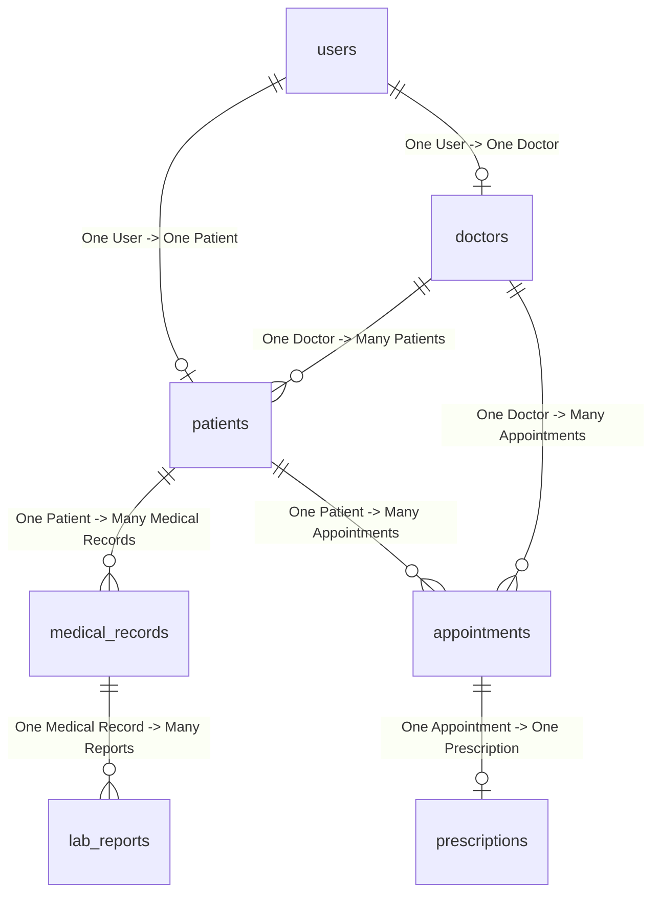

# MedVault Architecture Documentation

MedVault is designed using a clean, layered MVC Architecture pattern split into independent frontend and backend layers.

---

## 1. Backend Architecture (Spring Boot)

The Java backend uses standard Spring Boot practices layered as follows:
- **Presentation Layer (`controller`)**: Exposes REST APIs, maps inputs, and validates request payloads.
- **Service Layer (`service`)**: Contains core healthcare business logic, security logs generation, and file exporting services.
- **Repository Layer (`repository`)**: Handles MySQL database queries using Spring Data JPA.
- **Entities Layer (`entity`)**: Maps Java classes directly to MySQL tables using Hibernate.

---

## 2. Entity Relationship Model

Below is the database mapping model:

---

## 3. Security Design
- **BCrypt Encryption**: Passwords are encrypted before storing in the database.
- **JWT stateless filter**: Custom token validation intercepting REST APIs.
- **Role-Based Access Control**: Spring Security configurations secure APIs under `/api/admin/**`, `/api/doctor/**`, and `/api/patient/**` based on roles.
